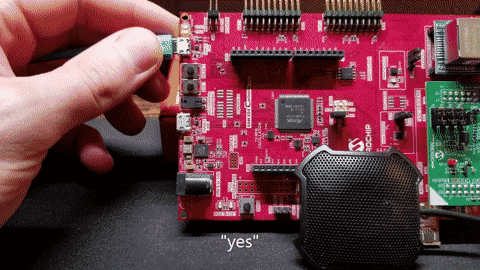

# Keyword Spotting with Edge Impulse

## Overview
This repository is a companion to the [Keyword Spotting with Edge Impulse
tutorial](https://microchipdeveloper.com/machine-learning:keywordspotting-with-edge-impulse)
on the Microchip Developer website. It contains the firmware to perform "yes"
"no" keyword spotting on a [SAME54 Curiosity
Ultra](https://www.microchip.com/DevelopmentTools/ProductDetails/PartNO/DM320210)
development board +
[WM8904](https://www.microchip.com/Developmenttools/ProductDetails/AC328904)
audio daughterboard, as well as some tools to build your own dataset from the
[Google Speech Commands](https://arxiv.org/abs/1804.03209) dataset.

## Benchmarks
Measured with ``-O2`` compiler optimizations and 120MHz Clock
- 171kB Flash
- 119kB RAM
- 145ms Inference time

## Changing Keywords
If you'd like to choose different keywords from the google speech commands for
your application, the `dataset` directory contains code and instructions for
generating a dataset.
